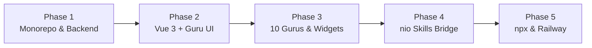

# OpenGuru — Master Architectural Plan & Feature Specification

> **The Multi-Guru AI Workspace powered by [nio-ai](https://github.com/nio-labs/nio)**

---

## 1. Executive Summary

**OpenGuru** is an open-source, self-hosted web application that delivers a specialized, multi-expert AI workspace. Rather than relying on a single generic AI chatbot, OpenGuru provides **10 dedicated "Gurus"**—each meticulously tuned with domain system prompts, specialized UI widgets (financial charts, SQL explain plans, interactive git diffs, Mermaid diagrams), and native access to the **`nio-ai` skill engine**.

---

## 2. Complete Features List

### A. The 10 Specialized Gurus (Out-of-the-Box)

#### Software & Engineering (6 Gurus)
1. **FrontendGuru (`frontend-guru`):**
   - **Lucide Icon:** `Layout` / `Code2`
   - **Domain:** Modern frontend frameworks (Vue 3, Nuxt, React, Next.js), Tailwind CSS, TypeScript, WebGL/Canvas, Web Vitals, accessibility.
   - **Specialized Widget:** Live component sandbox & visual preview drawer.
   - **Default Skills:** `web-component-gen`, `css-animation-inspector`, `bundle-analyzer`.
2. **BackendGuru (`backend-guru`):**
   - **Lucide Icon:** `Server` / `Database`
   - **Domain:** High-throughput APIs, Rust, Go, Node.js/Bun, SQLite, PostgreSQL, Redis, gRPC, database indexing, zero-copy I/O.
   - **Specialized Widget:** Interactive SQL Explain query plan visualizer and schema ER diagram generator.
   - **Default Skills:** `sql-query-optimizer`, `api-benchmark-runner`, `schema-generator`.
3. **ArchitectGuru (`architect-guru`):**
   - **Lucide Icon:** `Network` / `Boxes`
   - **Domain:** Distributed systems, microservices vs monolith trade-offs, cloud systems (AWS, GCP, Cloudflare), domain-driven design (DDD).
   - **Specialized Widget:** Interactive Mermaid system architecture and sequence diagram renderer.
   - **Default Skills:** `system-design-eval`, `cloud-cost-estimator`, `mermaid-diagram-gen`.
4. **DevOpsGuru (`devops-guru`):**
   - **Lucide Icon:** `Container` / `GitBranch`
   - **Domain:** Docker, Kubernetes, Terraform, GitHub Actions, Linux internals, Prometheus, Grafana, immutable infrastructure, zero-downtime deploys.
   - **Specialized Widget:** Real-time collapsible build/terminal log viewer & YAML manifest validator.
   - **Default Skills:** `dockerfile-linter`, `k8s-manifest-validator`, `ci-pipeline-builder`.
5. **SecurityGuru (`security-guru`):**
   - **Lucide Icon:** `ShieldCheck` / `Lock`
   - **Domain:** OWASP Top 10 vulnerabilities, auth protocols (OAuth2/OIDC/JWT), CVE auditing, cryptography primitives, zero-trust architecture.
   - **Specialized Widget:** Severity Checklist (Critical, High, Medium, Low) with automated remediation steps.
   - **Default Skills:** `code-security-audit`, `cve-scanner`, `secret-leak-detector`.
6. **DebugGuru (`debug-guru`):**
   - **Lucide Icon:** `Bug` / `FileDiff`
   - **Domain:** Root cause analysis, heap profiling, race condition diagnostics, core dump analysis, bisecting regression bugs.
   - **Specialized Widget:** Split-pane interactive side-by-side Git Diff viewer with one-click patch copying.
   - **Default Skills:** `stacktrace-demangler`, `heap-profile-parser`, `repro-script-builder`.

#### Markets & Finance (2 Gurus)
7. **TradingGuru (`trading-guru`):**
   - **Lucide Icon:** `CandlestickChart` / `TrendingUp`
   - **Domain:** Candlestick patterns, order flow, momentum indicators (RSI, MACD, VWAP, EMA), quant modeling, crypto & equity setups.
   - **Specialized Widget:** Interactive TradingView / Lightweight Charts with timeframe toggles (1H, 4H, 1D).
   - **Default Skills:** `candlestick-scanner`, `technical-indicators`, `risk-model`.
8. **FinanceGuru (`finance-guru`):**
   - **Lucide Icon:** `Scale` / `ReceiptText`
   - **Domain:** Discounted Cash Flow (DCF) modeling, SEC 10-K & 10-Q analysis, financial ratio analysis, earnings call summaries, macro trends.
   - **Specialized Widget:** Structured financial statement tables & KaTeX formula rendering.
   - **Default Skills:** `sec-filings`, `dcf-calculator`, `financial-ratios`.

#### Product & Research (2 Gurus)
9. **ProductGuru (`product-guru`):**
   - **Lucide Icon:** `FileText` / `Kanban`
   - **Domain:** Product Requirement Documents (PRDs), user stories, acceptance criteria, sprint planning, RICE / MoSCoW prioritization.
   - **Specialized Widget:** Collapsible PRD tabbed document generator (Context, User Stories, Acceptance Criteria, Out-of-Scope).
   - **Default Skills:** `prd-generator`, `user-story-mapper`, `sprint-planner`.
10. **ResearchGuru (`research-guru`):**
    - **Lucide Icon:** `BookOpen` / `GraduationCap`
    - **Domain:** Academic paper reviews, ArXiv synthesis, cross-domain technology research, structured note-taking, fact-checking.
    - **Specialized Widget:** Footnote citation cards with link previews and reference drawer.
    - **Default Skills:** `web-search`, `paper-summarizer`, `citation-linker`.

---

### B. Workspace & Interactive Capabilities
- **Chat-Style Guru Sidebar (`GuruList.vue` / `GuruItem.vue`):**
  - **Avatar-First Design:** Styled like a modern messaging app (Discord / Slack DMs) with distinctive circular/rounded avatars, neon domain accents, and an active status badge (pulsing green "Engine Ready" indicator).
  - **Contact Card Layout:** Shows Guru avatar, name, domain badge, and preview snippet of the last active conversation.
  - **Pin to Top:**
    - Any Guru can be pinned to the top of the sidebar with a single click (using Lucide `Pin` icon).
    - Two clear sections: **PINNED GURUS** (`Pin` icon) and **ALL GURUS** (`Users` icon).
    - User pin preferences persist automatically in SQLite / local storage.
- **Strict Design System (No Emojis):**
  - **Zero Emojis in UI:** Emojis are strictly banned from UI chrome, buttons, headers, cards, and avatars.
  - **shadcn-vue:** All primitives use standard `shadcn-vue` components (`Avatar`, `Badge`, `Button`, `Dialog`, `DropdownMenu`, `Accordion`, `ScrollArea`, `Tooltip`).
  - **Lucide Icons:** All icons across the app use `lucide-vue-next` exclusively.
- **Typography — Martian Mono Everywhere:**
  - **Universal Font:** Use **Martian Mono** (`@fontsource/martian-mono`) across the **entire application** without exception (UI chrome, sidebar, contact cards, navigation, headers, body copy, markdown, forms, buttons, code blocks, and data tables).
  - Configured globally in Tailwind CSS (`fontFamily: { sans: ['"Martian Mono"', 'monospace'], mono: ['"Martian Mono"', 'monospace'] }`) and root CSS for a distinct, high-tech monospaced aesthetic.
- **Light & Dark Theme Engine:**
  - Full support for **Light**, **Dark**, and **System** (OS auto-detection) themes via `@vueuse/core` (`useColorMode`) and Tailwind CSS variables.
  - Quick theme toggle in sidebar footer and header (using Lucide `Sun`, `Moon`, `Monitor` icons).
  - Code blocks, diff viewers, and TradingView financial charts automatically synchronize color palettes with the active theme.
- **Custom Guru Creator:** UI dialog (`+ Create New Guru`) to create custom personas with custom system prompts, avatars, default models, and attached skills.
- **Full Conversation History:** SQLite-backed thread storage with search, renaming, pinning, and deletion.
- **Model Selector Dropdown:** Switch dynamically between models supported by `nio` (`kilo-auto/free`, `anthropic/claude-3-5-sonnet`, `deepseek-r1`, `gpt-4o`, local Ollama).

### C. Native `nio` Engine & Skill Integration
- **`read_skill_file` Live Accordion:** When a Guru consults a skill, the UI renders an expandable drawer showing the skill name and markdown instructions loaded.
- **Real-Time Tool Execution:** Displays live streaming stdout/stderr and exit codes for all tool calls (`run_command`, `read_file`, `write_file`, `git_status`).
- **On-the-Fly Skill Toggle:** Active skill pills in the chat header allow toggling or adding ad-hoc skills to any conversation.
- **Skill Marketplace / Catalog:** List installed skills from `~/.config/nio/skills/` and install new community skills via GitHub URLs.

### D. Composer & Prompt Ergonomics
- **Dynamic Context Placeholder:** Shows `Ask FrontendGuru...`, `Ask TradingGuru...` based on active Guru.
- **`/Skills` Quick Command Palette:** Quick keyboard shortcut to trigger and inspect installed skills.
- **File & Code Attachments:** Drag-and-drop code files, CSVs, logs, or screenshots.
- **Prompt Keyboard Shortcuts:** Enter to send, Shift+Enter for newlines, Cmd/Ctrl+K to search history.

### E. Distribution & Deployment Targets
- **Zero-Install CLI (`npx openguru` / `bunx openguru`):**
  - **Automatic `nio` CLI Bundling:** Running `npx openguru` automatically checks for `nio` (`nio-ai`). If not found in `PATH` or standard locations (`~/.nio/bin/nio`, `~/.local/bin/nio`, `~/.cargo/bin/nio`), it automatically bundles and installs it in the background (`npx -y nio-ai` or curl/PowerShell fallback) without requiring manual user intervention.
  - Starts the local Hono server, binds to dynamic or default port `3000`, and opens the user's default browser automatically.
  - Opens the default browser to `http://localhost:3000`.
- **1-Click Railway Deployment:**
  - Multi-stage Docker container with persistent storage volume mounted at `/data` (`/data/openguru.db`).
  - Single-password authentication gate via `APP_PASSWORD`.
  - Free automatic SSL (`https://...up.railway.app`).

---

## 3. Technology Stack

| Layer | Technologies |
| :--- | :--- |
| **Frontend** | Vue 3, Vite, Tailwind CSS, shadcn-vue (Reka UI), Lucide Icons, Pinia, Lightweight Charts, KaTeX |
| **Backend** | Hono (Node.js & Bun compatible), Server-Sent Events (SSE), Subprocess Manager |
| **Database** | SQLite via Drizzle ORM (`better-sqlite3`), zero external DB dependencies |
| **AI Engine** | `nio` CLI (`nio-ai`) executing models and standard `SKILL.md` packages |
| **Distribution** | npm package (`npx openguru`) & Docker / Railway template |

---

## 4. Implementation Phases

### Phase 1: Monorepo & Backend Engine
- Initialize pnpm monorepo structure (`apps/web`, `apps/server`, `packages/gurus`).
- Setup Hono backend with SQLite (`better-sqlite3` + Drizzle ORM).
- Build database schema: `gurus`, `conversations`, `messages`, `settings`.
- Implement `nio` process runner service and SSE streaming route `/api/chat/stream`.

### Phase 2: Vue 3 Frontend & Chat Core
- Setup Vite + Vue 3 + Tailwind CSS + `shadcn-vue`.
- Build application shell: collapsible `GuruList` sidebar, session history, engine status footer.
- Build chat message stream with Markdown parser, code syntax highlighting, and copy buttons.
- Build `ToolCallCard.vue` collapsible accordions for `read_skill_file` and `run_command`.

### Phase 3: The 10 Gurus & Specialized Widgets
- Populate default Guru manifests in `packages/gurus/*.json`.
- Implement TradingView Lightweight Charts widget for **TradingGuru**.
- Implement KaTeX math and financial statement tables for **FinanceGuru**.
- Implement interactive Git Diff viewer for **DebugGuru**.
- Implement Mermaid architecture renderer for **ArchitectGuru**.
- Implement Custom Guru creation/edit modal.

### Phase 4: `nio` Skills Bridge & Polish
- Connect backend to `nio skills list --format json`.
- Implement `/Skills` command palette and header skill pills.
- Add optional `APP_PASSWORD` authentication gate for hosted deployments.

### Phase 5: Distribution & Launch
- Create `bin/openguru.js` executable for `npx openguru`.
- Create multi-stage `Dockerfile` and `railway.json`.
- Add documentation, badges, and automated GitHub Actions release workflow.
