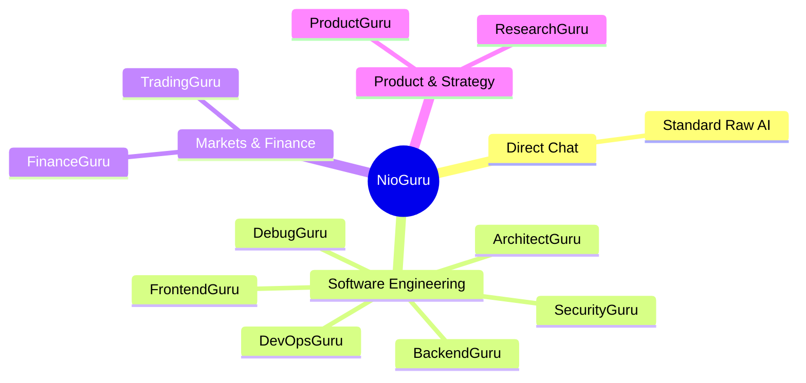
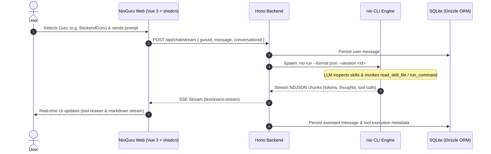

# NioGuru

> **The Multi-Guru AI Workspace powered by [@nio-labs/nio-ai](https://github.com/nio-labs/nio)**

NioGuru is an open-source, self-hosted web interface designed for specialized AI collaboration. Alongside standard unconstrained **Direct Chat**, NioGuru provides a suite of **10 specialized Gurus**—expert personas focused on software engineering, distributed systems, quantitative trading, valuation, and deep research—all backed by the high-performance `nio` CLI execution engine.

---

## Key Highlights

- **Direct Chat & 10 Domain-Specific Gurus:** Toggle effortlessly between unfiltered raw chat and specialized Gurus with tuned system prompts, domain knowledge, and specialized UI widgets.
- **Chat-Style Avatar Sidebar with Pin-to-Top:** Clean DM-style contact cards with avatar initials/glyphs, status badges, prompt snippets, and instant pin-to-top organization (Direct Chat pinned by default).
- **Universal Martian Mono Typography:** Beautiful brutalist developer aesthetic powered strictly by **Martian Mono** across all typography, code, and UI chrome.
- **Light & Dark Theme Engine:** Seamless switching between Light, Dark, and System mode via Tailwind CSS variables and `@vueuse/core`.
- **shadcn-vue & Lucide Icons:** Clean, professional UI built strictly without emojis, using official `shadcn-vue` design primitives and `lucide-vue-next` icons.
- **Automatic `nio` CLI Bundling:** Running `npx @nio-labs/nio-guru` automatically checks for and bundles `nio` (`@nio-labs/nio-ai`), launching with zero prerequisite setup.
- **Native Skill System Integration:** Seamlessly leverage `nio`'s skill engine (`read_skill_file` and tool execution) to run complex workflows.
- **Zero-Install CLI Mode:** Run instantly on any machine with `npx @nio-labs/nio-guru` (or `bunx @nio-labs/nio-guru`).
- **One-Click Cloud Deployment:** Ready-to-deploy **Railway** template with SQLite persistent volume (`/data`) and single-password gate (`APP_PASSWORD`).
- **Ultra-Fast Backend:** Powered by **Hono** (Node.js & Bun) with **SQLite** via **Drizzle ORM** and real-time Server-Sent Events (SSE).

---

## Direct Chat & The 10 Gurus



### Standard Chat

| Item | Focus & Behavior | Key Skills & Capabilities | UI Specialization |
| :--- | :--- | :--- | :--- |
| **Direct Chat** | Unfiltered general-purpose chat, raw model reasoning, zero prompt wraps | None (raw model output) | Clean markdown stream with code syntax highlighting |

### Software Engineering (6 Gurus)

| Guru | Focus & Technologies | Key Skills & Capabilities | UI Specialization |
| :--- | :--- | :--- | :--- |
| **FrontendGuru** | Vue 3, Nuxt, React, Tailwind CSS, TypeScript, Web Vitals, a11y | `web-components`, `css-animation`, `bundle-analyzer` | Component visual sandbox & preview drawer |
| **BackendGuru** | Rust, Go, Node.js, Bun, SQLite, PostgreSQL, Redis, gRPC, APIs | `sql-optimizer`, `api-benchmark`, `schema-gen` | SQL explain query plan analyzer & ER diagrams |
| **ArchitectGuru** | Distributed systems, microservices, cloud (AWS/GCP/Cloudflare), DDD | `system-design-eval`, `cloud-cost`, `mermaid-gen` | Interactive Mermaid architecture diagrams |
| **DevOpsGuru** | Docker, Kubernetes, Terraform, GitHub Actions CI/CD, Prometheus | `dockerfile-linter`, `k8s-validator`, `ci-builder` | Collapsible build logs & YAML syntax validator |
| **SecurityGuru** | OWASP Top 10, Auth/JWT/OAuth2, CVE auditing, cryptography | `code-security-audit`, `cve-scanner`, `secret-detector` | Color-coded severity checklist (Critical to Low) |
| **DebugGuru** | Memory profiling, core dumps, race conditions, regression triage | `stacktrace-demangler`, `heap-profiler`, `repro-builder` | Side-by-side interactive Git Diff viewer |

### Markets & Finance (2 Gurus)

| Guru | Focus & Technologies | Key Skills & Capabilities | UI Specialization |
| :--- | :--- | :--- | :--- |
| **TradingGuru** | Price action, candlestick patterns, RSI/MACD/VWAP, quant models | `candlestick-scanner`, `technical-indicators`, `risk-model` | Embedded interactive financial charts |
| **FinanceGuru** | DCF valuation, SEC 10-K/10-Q filings, balance sheet ratios | `sec-filings`, `dcf-calculator`, `financial-ratios` | Financial statement tables & KaTeX formulas |

### Product & Research (2 Gurus)

| Guru | Focus & Technologies | Key Skills & Capabilities | UI Specialization |
| :--- | :--- | :--- | :--- |
| **ProductGuru** | Technical PRDs, user stories, acceptance criteria, sprint specs | `prd-generator`, `user-story-mapper`, `sprint-planner` | Structured PRD document tabs & checklists |
| **ResearchGuru** | Academic literature, paper synthesis, web queries, fact-checking | `web-search`, `paper-summarizer`, `citation-linker` | Footnote citation cards & source drawer |

---

## Architecture & Data Flow



---

## Repository Structure

```
nio-guru/
├── README.md                  # Project overview & documentation
├── package.json               # Monorepo root configuration (pnpm workspaces)
├── pnpm-workspace.yaml        # Workspace packages definition
├── bin/
│   └── nio-guru.js           # CLI runner for `npx @nio-labs/nio-guru`
├── apps/
│   ├── web/                  # Vue 3 Frontend
│   │   ├── src/
│   │   │   ├── components/   # GuruList, ChatFeed, ToolDrawer, Composer
│   │   │   ├── stores/       # Pinia stores (chat, gurus, settings)
│   │   │   ├── lib/          # SSE client, markdown & KaTeX parsers
│   │   │   └── App.vue
│   │   └── vite.config.ts
│   └── server/               # Hono Backend
│       ├── src/
│       │   ├── db/           # SQLite schema & Drizzle migrations
│       │   ├── routes/       # REST API & SSE streaming routes
│       │   ├── services/     # nio CLI subprocess manager & skill bridges
│       │   └── index.ts
│       └── package.json
├── packages/
│   └── gurus/                # Guru manifest definitions (JSON / Markdown)
│       ├── frontend-guru.json
│       ├── backend-guru.json
│       ├── trading-guru.json
│       └── ...
├── Dockerfile                # Multi-stage production container
└── railway.json              # 1-Click Railway deployment configuration
```

---

## Quick Start

### 1. Run Instantly (No Installation Required)

```bash
npx @nio-labs/nio-guru
```

*Automatically checks for and bundles `nio` (`@nio-labs/nio-ai`), initializes your local SQLite storage, spins up the Hono server, and opens NioGuru in your default browser at `http://localhost:3000`.*

Install globally with `npm install -g @nio-labs/nio-guru`, then run `nio-guru`. Use `nio-guru --no-browser` when running without a desktop browser.

### 2. Local Development

```bash
# Clone the repository
git clone https://github.com/nio-labs/nio-guru.git
cd nio-guru

# Install dependencies
pnpm install

# Start development servers (frontend + backend)
pnpm dev
```

### 3. Deploy to Railway

[](https://railway.app)

1. Connect your repository or click the Railway template.
2. Set environment variables:
   - `APP_PASSWORD`: (Optional) Single password protecting access to the UI.
   - `PORT`: `3000`
3. Mount persistent storage volume at `/data` for `openguru.db`.

---

NioGuru continues to use existing `~/.openguru`, `openguru.db`, and saved browser settings, so workspaces and preferences carry over from OpenGuru.

## License

MIT © [nio-labs](https://github.com/nio-labs)
