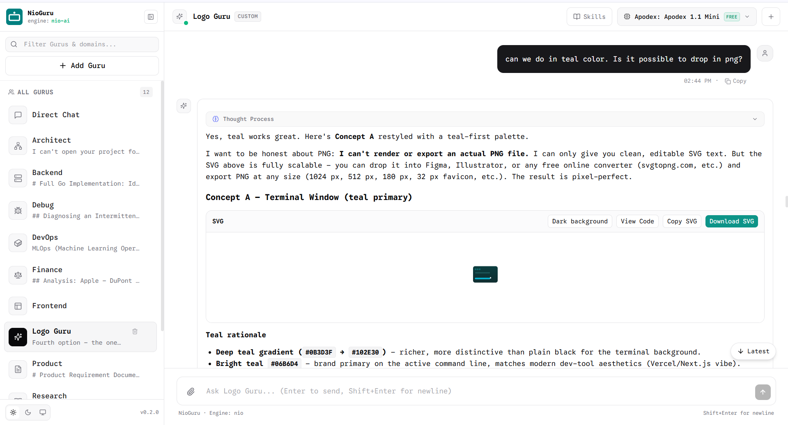

# NioGuru

NioGuru is a self-hosted chat workspace powered by the [Nio CLI](https://github.com/nio-labs/nio). Chat directly, choose one of ten expert Gurus, or create your own specialist with instructions and selected skills.



## Quick start

Requires Node.js 20 or later.

```bash
npx @nio-labs/nio-guru@latest
```

The launcher checks for Nio CLI, attempts to install it if needed, and opens the workspace at `http://localhost:3000`. If automatic installation fails, install Nio using [its setup instructions](https://github.com/nio-labs/nio), then restart NioGuru. Configure a working model provider in Nio before chatting.

```bash
# Install globally
npm install -g @nio-labs/nio-guru
nio-guru

# Choose a port or run without opening a browser
nio-guru --port 3001 --no-browser
```

### ☁️ 1-Click Deploy to Railway

Deploy your personal NioGuru workspace in one click:

[](https://railway.app/template/new?template=https%3A%2F%2Fgithub.com%2Fnio-labs%2Fnio-guru)

- **Persistent Storage:** Mount a volume at `/data` (`RAILWAY_VOLUME_MOUNT_PATH=/data`) so your SQLite database, custom Gurus, and chat history persist across redeploys.
- **Nio AI Chat:** Bundled with Nio CLI (`@nio-labs/nio-ai`) out of the box.
- **Password Protection (Optional):** Define `APP_PASSWORD` environment variable to secure your private deployment.
- **Free Automatic SSL:** Access directly via `https://<your-project>.up.railway.app`.

## What's new in 0.3.1

- **1-Click Railway Deployment:** Instant zero-config cloud deployment with persistent storage volume for the SQLite database, custom Gurus, and chat history.
- **Automated CI/CD Workflows:** Automated GitHub Actions release pipeline for tags with GitHub Releases and npm publishing.

### Added in 0.3.0

- **File attachments:** Attach text and images with the paperclip, drop files into the chat, or paste from the clipboard. Attachments appear in the conversation and can be removed before sending.
- **Image reading:** Adding an image selects StepFun automatically, including if the model was changed before sending.

### Added in 0.2.0

- **Custom Gurus:** Add a name, description, instructions, and an icon from 120 Lucide choices. Fill with AI drafts the fields and selects relevant available skills. Review and edit the draft before creating the Guru.
- **Skills in the UI:** Search installed and bundled skills, view collapsed descriptions, and select multiple skills per Guru. Install additional skills from a GitHub repository with an optional folder path.
- **Offline defaults:** Pinned upstream skills and supporting files are bundled with the server. Built-in defaults need neither Git nor GitHub access. Additional GitHub installations require server network access and Git.
- **Chat history:** Loading skeletons and pages of 30 messages reduce initial loading. Scroll upward to load older messages while preserving your reading position.
- **Streaming:** Stop confirmation when switching chats, stable Markdown blocks, and a Latest button when you scroll away from incoming output.
- **Rendering:** Mermaid diagrams, highlighted code, and KaTeX formulas. SVG cards support preview backgrounds, code view, copying, and downloading; safe class styling is preserved.
- **Skill recovery:** Missing-skill errors offer an install action. If the package is already available, add it to the Guru; otherwise supply its GitHub source.
- **Branding:** NioGuru naming, Google Sans Code typography, light/dark/system themes, and a matching teal-and-white app mark and favicon.

Custom Gurus can be deleted. Confirming deletion permanently removes that Guru and its conversations. Built-in Gurus cannot be deleted.

## Built-in Gurus

| Guru | Focus | Default skills |
| --- | --- | --- |
| Direct Chat | General conversation | None |
| Frontend | UI and frontend engineering | `frontend-design`, `svg-design` |
| Backend | APIs, databases, and backend engineering | `supabase-postgres-best-practices`, `error-handling-patterns` |
| Architect | Architecture and distributed systems | `architecture-patterns` |
| DevOps | Delivery and operations | `deployment-pipeline-design` |
| Security | Security analysis | `stride-analysis-patterns` |
| Debug | Debugging and diagnosis | `debugging-strategies`, `error-handling-patterns` |
| Trading | Trading research | `backtesting-frameworks`, `risk-metrics-calculation` |
| Finance | Financial analysis | `risk-metrics-calculation`, `data-storytelling` |
| Product | Product planning and documentation | `doc-coauthoring` |
| Research | Research synthesis and documentation | `doc-coauthoring` |

## Skills

Open **Skills** in a Guru's chat to manage its selections. Selected skills appear first, and descriptions are collapsed by default. Save an empty selection to use no skills. Install packages from the Skills dialog or Add Guru form using a GitHub URL and optional skill folder.

Skills provide guidance; they do not add model capabilities. A comic skill can guide scripts and image prompts, but actual image generation requires an image backend. NioGuru runs chat turns in Nio's `ask` mode with project and shell tools disabled. It retains `read_skill_file` for selected packages and their references.

Each turn receives a private Nio catalog containing only the Guru's selected, enabled packages. Native user installations take precedence over bundled copies, including disabled state. Missing selections produce a warning, and the turn continues with available skills. The server supplies exact available names to avoid invented skill calls.

The temporary `NIO_CONFIG` includes a provider configuration copy, selected packages, and a link to persistent Nio sessions. Temporary files are removed after the process exits. The shared native registry and other Gurus' selections are preserved. An uninstall of a previously observed native override does not silently restore its bundled version.

You can also manage native packages with Nio CLI, using the server's account and configuration:

```bash
nio --skills add https://github.com/org/repo skills/my-skill
nio --skills enable my-skill
```

Pinned sources and revisions are recorded in [packages/bundled-skills/manifest.json](packages/bundled-skills/manifest.json); supporting files and license notices are embedded in the compiled server. Maintainers can regenerate snapshots with `python3 scripts/bundle-skills.py`, or use `--refresh` to update upstream revisions. This maintenance command needs network access.

## Models and sessions

Use the paperclip, drop files anywhere in the chat window, or paste copied files and images to attach UTF-8 text files or PNG, JPEG, GIF, and WebP images. Attaching an image switches the conversation to StepFun for image reading. Remove individual files before sending, or send attachments without a written prompt. Nio receives each uploaded file through `--file`. PDF is not supported by Nio yet; export its text or attach page images instead.

Messages accept up to 8 files, with a 10 MB limit per image and 20 MB combined limit. The message and text attachments together are limited to 16 KB to leave room for Guru instructions in Nio's prompt budget. Original uploads are staged privately for the turn and removed after completion or cancellation. Attachment names and sizes remain in chat history; original files are not stored for later download.

New chats prefer an available free model in this order: **Apodex**, **North Mini Code**, then **Kilo Auto**. Existing available conversation models and deliberate model selections are preserved. If catalog loading fails, Kilo Auto Free is the fallback.

Each conversation is bound to its own Nio session using `-s`. Streaming requests save messages and tool metadata in SQLite. Changing Gurus or starting another conversation during a response prompts you to stop the current response first.

## Development

```bash
git clone https://github.com/nio-labs/nio-guru.git
cd nio-guru
pnpm install
pnpm dev

# Build frontend and server
pnpm build
pnpm start
```

| Directory | Purpose |
| --- | --- |
| `apps/web` | Vue 3 UI, Pinia state, Markdown and SVG rendering |
| `apps/server` | Hono API, SQLite/Drizzle storage, Nio subprocesses |
| `packages/gurus` | Built-in Guru manifests |
| `packages/shared` | Shared model selection and icon names |
| `packages/bundled-skills` | Pinned upstream package manifest |
| `bin/nio-guru.js` | npm command launcher |
| `scripts/bundle-skills.py` | Upstream skill snapshot maintenance |

## Hosting and storage

Use the included Dockerfile or deploy the repository on Railway. Mount a persistent volume at `/data` and set `RAILWAY_VOLUME_MOUNT_PATH=/data`. `PORT` defaults to `3000`; `HOST` defaults to `0.0.0.0`. Set `DATABASE_PATH` to choose an explicit SQLite path and `NIO_BIN` to select a Nio executable.

New local installs store conversations in `~/.nioguru/nioguru.db`. Existing `~/.openguru/openguru.db` databases and legacy browser preferences are reused to preserve data. Persistent deployments similarly reuse an existing legacy database.

`APP_PASSWORD` optionally protects API requests using `X-App-Password` or a `password` query parameter. The health endpoint remains public. The web UI does not currently provide a password sign-in flow, so deployments using this setting must arrange credential forwarding.

## License

MIT © [nio-labs](https://github.com/nio-labs). Bundled upstream skills retain their included license notices.
